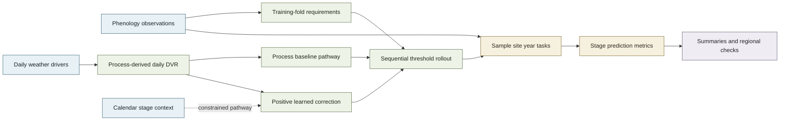
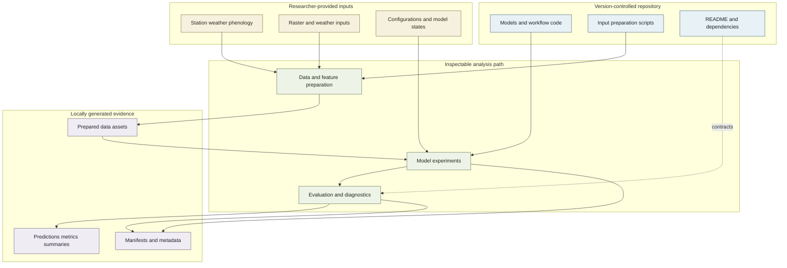

# Rice Phenology Hypernet

Maintained model implementations and workflow interfaces for evaluating daily development-rate (DVR) correction in rice phenology prediction.

This repository provides the scientific models, shared rollout logic, evaluation utilities, regional-analysis modules, and input-preparation scripts that support the accompanying study. It is organized so that readers can trace how observations and environmental drivers enter the analysis, how each model changes daily phenological development, and where locally generated evidence is recorded.

## Overview

The study asks whether a learned, positive correction to process-derived daily DVR can improve phenological-stage prediction while retaining an explicit accumulated-development model. All current models use the same ordered stages - tillering, jointing, booting, heading, and maturity - and the same completion rule: accumulate daily progress, select the first day that crosses the stage requirement, then start the next stage on the following day.

| At a glance | Repository scope |
| --- | --- |
| **Scientific question** | Can sequence learning correct daily process rates without replacing threshold-based phenology? |
| **Maintained model set** | Two process baselines and two learned DVR-correction models |
| **Evaluation layers** | `sample`, `site`, and `year` task identifiers; stage-wise metrics; regional climatology checks |
| **Prediction targets** | Tillering, jointing, booting, heading, and maturity day of year |
| **Reader entry points** | Model definitions, experiment contracts, metrics, regional projection, and provenance utilities |

### Scientific framework



*The comparison changes the source of daily progress while preserving a common sequential threshold-crossing definition of stage completion.*

## Models and evaluation

### Model families and scientific roles

The current public registry is defined by `PAPER_MODEL_NAMES` in [`dvr_core.py`](src/rice_phenology_hypernet/experiments/dvr_core.py). Reader-facing descriptions below follow the implemented inputs and operations rather than inferring names from identifiers.

| Model | Scientific role | Daily inputs and structure | Constraint or correction | Prediction output |
| --- | --- | --- | --- | --- |
| `m0_t` | Temperature-only process baseline | Mean temperature enters a trapezoidal response | No photoperiod effect; training-fold stage requirements determine completion | First crossing DOY for each stage |
| `m0_dvr` | Photothermal process baseline | Mean temperature plus calculated daylength | Oryza2000-style photoperiod response is applied during booting and heading | First crossing DOY for each stage |
| `m1_v2_dvr` | Weather-sequence DVR correction | Five daily weather features, stage index, and workflow-supplied base DVR enter a GRU with stage-specific heads | A clamped log correction is exponentiated, giving a positive multiplicative DVR modifier | Corrected daily DVR, cumulative progress, completion distribution, and crossing DOY |
| `m1_dvr_con` | Context-constrained DVR correction | `m1_v2_dvr` inputs plus stage-start DOY and days since transplanting | Stage-specific gates control background context; prior and monotonic penalties regularize the gates | The same corrected progress outputs plus learned gate values |

The default weather sequence is `TemAver`, `TemMin`, `TemMax`, `daylength`, and `Precipitation`. In the regional projection path, both learned models correct the photothermal base DVR used by `m0_dvr`. The two learned models share the objective in [`dvr_objective.py`](src/rice_phenology_hypernet/models/dvr_objective.py): event timing, terminal progress, correction shrinkage, temporal smoothness, and mean-correction anchoring. `m1_dvr_con` adds penalties for departure from its configured gate prior and for increases in gate strength across successive stages. Architecture and loss values are supplied through configuration objects; the repository does not embed study-run hyperparameters as universal defaults.

<details>
<summary>Model identifiers outside the current registry</summary>

The tracked `main` branch does not register implementations named `m1_dvr`, `m3_direct`, or other model aliases. Because the current code does not establish their scientific role, this guide does not map those identifiers to paper terminology or present them as supported workflow options. The authoritative maintained set is `m0_t`, `m0_dvr`, `m1_v2_dvr`, and `m1_dvr_con`.

</details>

### Evaluation design

The experiment runner enforces the parts of the evaluation that must remain comparable across models:

1. Split records through the supplied backend.
2. Estimate all five stage requirements from each fold's training records only.
3. Fit a learned model when the selected model requires one.
4. Construct stage inputs, calculate base DVR, and obtain any learned modifier.
5. Correct and accumulate daily DVR, take the first requirement crossing, and advance sequentially.
6. Return predictions, scores, and an audit record containing task, model, seed, call order, and fold provenance.

The summary layer recognizes the task identifiers `sample`, `site`, and `year`. Their sampling rules are deliberately owned by the injected `DvrWorkflowBackend`; a study-specific backend and configuration therefore form part of the provenance needed to recreate a particular evaluation. Metrics are MAE, RMSE, mean signed bias, R-squared, and sample count for each stage, with an additional across-stage mean summary. Relative-change tables use `m0_dvr` as the implemented comparison baseline.

Regional analysis is a separate evidence layer. It projects the same four-model set to prepared grid point-years, builds period climatologies, and compares heading and maturity DOY with remote-sensing references. This is implemented as a bounded regional consistency analysis, not as a substitute for the station-level task definitions.

## Evidence map and data flow

### Scientific traceability

| Scientific role | Repository implementation | Main interface | Generated evidence |
| --- | --- | --- | --- |
| Thermal and photoperiod response | [`models/physics.py`](src/rice_phenology_hypernet/models/physics.py), [`models/m0.py`](src/rice_phenology_hypernet/models/m0.py) | `trapezoidal_temperature_response`, `oryza2000_photo_response`, `M0TPhenologyModel`, `M0PhenologyModel` | Inverted stage-requirement samples and process stage predictions |
| Learned DVR correction | [`models/m1_v2_dvr.py`](src/rice_phenology_hypernet/models/m1_v2_dvr.py), [`models/m1_dvr_con.py`](src/rice_phenology_hypernet/models/m1_dvr_con.py) | `M1V2DvrModel`, `M1ConDvrModel`, `compute_m1_dvr_con_loss` | Modifier, corrected-DVR, cumulative-progress, and completion tensors |
| Fold-isolated experiment rollout | [`experiments/runner_dvr.py`](src/rice_phenology_hypernet/experiments/runner_dvr.py) | `run_dvr_experiment`, `DvrWorkflowBackend` | `DvrExperimentBundle` with predictions, metrics, and audit metadata |
| Stage evaluation and comparison | [`evaluation/metrics.py`](src/rice_phenology_hypernet/evaluation/metrics.py), [`experiments/dvr_summary.py`](src/rice_phenology_hypernet/experiments/dvr_summary.py) | `calculate_metrics_frame`, `build_dvr_relative_change_summary` | Per-stage metric frames and DVR relative-change CSV files |
| Regional consistency analysis | [`regional_grid_projection.py`](src/rice_phenology_hypernet/experiments/regional_grid_projection.py), [`regional_grid_analysis.py`](src/rice_phenology_hypernet/experiments/regional_grid_analysis.py) | `prepare_regional_grid_inputs`, `run_regional_grid_projection`, `analyze_regional_grid_projection` | Point-year predictions, climatology tables, heading/maturity metrics, and JSON metadata |
| Run identity and provenance | [`runtime.py`](src/rice_phenology_hypernet/runtime.py) | `initialize_run`, `register_experiment`, `update_run_metadata` | Timestamped run directories, `latest.json`, config snapshots when available, and `run_manifest.json` |

### Repository evidence and provenance flow



*The analytical logic is version controlled; study inputs and run settings enter through explicit interfaces, and derived evidence remains linked to local run metadata.*

## Repository structure

Only paths tracked in Git are shown here. The committed `data/` and `artifacts/` trees contain directory placeholders rather than study records or completed runs.

```text
.
|-- README.md
|-- requirements.txt
|-- src/rice_phenology_hypernet/
|   |-- data/                 # station I/O and daylength
|   |-- models/               # process and learned DVR models
|   |-- experiments/          # rollout, summaries, and regional analysis
|   |-- evaluation/           # stage-level metrics
|   |-- runtime.py            # run ids, manifests, output discovery
|   |-- settings.py           # repository-relative path contract
|   `-- types.py              # input and result dataclasses
|-- scripts/
|   |-- china_rice_calendar/  # calendar download and raster preparation
|   `-- meteo_download/       # regional weather acquisition and QC
|-- data/                     # local input and prepared-data locations
`-- artifacts/                # local model, evaluation, figure, and table locations
```

The central ownership boundary is `DvrWorkflowBackend`: the repository runner owns scientific ordering and threshold rollout, while the backend supplies data splitting, feature construction, model fitting, prediction-record construction, and scoring. Regional deployment uses the analogous `RegionalModelProvider` contract so that model-state loading is explicit rather than coupled to one private storage layout.

## Getting started

The repository is a source tree rather than an installable Python package: no `pyproject.toml` or console entry point is tracked. Use `PYTHONPATH=src` when importing the package.

```bash
git clone https://github.com/SmartAG-NWAFU/rice_phenology_hypernet.git
cd rice_phenology_hypernet
python -m venv .venv
source .venv/bin/activate
python -m pip install --upgrade pip
python -m pip install -r requirements.txt
export PYTHONPATH=src
```

Inspect the maintained helper interfaces without supplying research data:

```bash
python scripts/china_rice_calendar/extract_middle_rice_pixels.py --help
python scripts/meteo_download/standardize_regional_grid_weather_gee.py --help
PYTHONPATH=src python -c "from rice_phenology_hypernet.experiments.runner_dvr import validate_recording_backend_contract; validate_recording_backend_contract(); print('workflow contract: ok')"
```

### Input contracts

| Input | Minimum implemented contract | Typical local location | Ownership |
| --- | --- | --- | --- |
| Station weather | CSV with `SID`, parseable `Date`, and numeric `TemAver`; optional recognized fields include `year`, `TemMin`, `TemMax`, `Precipitation`, and `Radiation` | `data/raw/` | Researcher provided |
| Station phenology | Excel table with `SID` (or `station ID`), `year`, `lat`, `lon`, `reviving date`, and chronologically ordered available stage dates | `data/raw/` | Researcher provided |
| Rice calendar | Period-specific transplanting, heading, and maturity GeoTIFFs | `data/external/china_rice_calendar/` | Downloaded or researcher provided |
| Regional weather | Point CSVs or standardized Parquet shards with point, date, temperature, precipitation, and location fields | `data/processed/` | Prepared locally |
| Experiment settings | Objects satisfying `DvrExperimentConfig`, including learned-model architecture and loss settings | Researcher selected | Study-specific |
| Trained deployment models | Four prepared models and per-stage requirements supplied by `RegionalModelProvider` | Commonly `artifacts/models/` | Study-specific |

Station-table preparation is exposed through `prepare_data_assets(RawDataPaths, PreparedDataPaths)` in [`data/io.py`](src/rice_phenology_hypernet/data/io.py). It standardizes and intersects station-year records, then writes cleaned weather and phenology Parquet files to caller-selected paths. The additional `modeling_dataset` and `threshold_samples` fields in `PreparedDataPaths` reserve explicit downstream destinations; this preparation function does not populate them.

## Running the workflow

### Main DVR experiment interface

`run_dvr_experiment` is the maintained orchestration interface. The following is an **expected invocation pattern**, not a self-contained paper run: `config` and `backend` must be supplied from the study data and evaluation design.

```python
from rice_phenology_hypernet.experiments.runner_dvr import (
    ExperimentSpec,
    run_dvr_experiment,
)

spec = ExperimentSpec(task="site", model_name="m1_dvr_con", seed=42)
bundle = run_dvr_experiment(spec=spec, config=config, backend=backend)

predictions = bundle.predictions
metrics = bundle.metrics
audit = bundle.audit
```

There is no tracked top-level command that constructs the paper's study-specific backend, hyperparameter objects, or trained states. Consequently, the public tree supports inspection and integration of the maintained method interfaces, while an end-to-end paper run additionally requires those external inputs.

### Regional input preparation

The calendar and weather scripts are independent CLI utilities. Their interfaces can be audited with `--help`; commands that contact the Harvard Dataverse or a local GEE service additionally require network/service access.

```bash
# Networked metadata check; prints the planned ChinaRiceCalendar downloads.
python scripts/china_rice_calendar/download_rice_calendar.py \
  --output-dir data/external/china_rice_calendar/dataverse_v8/rice_pixels \
  --dry-run

# Local raster-to-table preparation after the GeoTIFFs are present.
python scripts/china_rice_calendar/extract_middle_rice_pixels.py \
  --data-dir data/external/china_rice_calendar/dataverse_v8/rice_pixels \
  --output-dir data/artifacts/features/china_rice_calendar \
  --periods 2003_2007 \
  --output-stem middle_rice_pixels_2003_2007_lat16_35

# Local QC and standardization after regional point weather has been acquired.
python scripts/meteo_download/standardize_regional_grid_weather_gee.py \
  --input-dir data/processed/regional_grid_weather_gee_era5_2003_2022 \
  --output-dir data/processed/regional_grid_weather_gee_era5_2003_2022_clean
```

<details>
<summary>Regional projection programmatic interfaces</summary>

`prepare_regional_grid_inputs(...)` joins the supported `2003_2007` calendar product to available point-year weather and records valid and excluded locations. `run_regional_grid_projection(...)` requires a `RegionalProjectionSpec` and `RegionalModelProvider`; it writes yearly predictions plus projection metadata. `analyze_regional_grid_projection(...)` converts those predictions into a multi-year climatology and heading/maturity metrics.

The current regional period registry contains `2003_2007`. Other calendar periods handled by the preparation scripts are not automatically supported by the projection registry.

</details>

## Outputs, provenance, and repository scope

| Path or object | Content | Provenance behavior |
| --- | --- | --- |
| `DvrExperimentBundle` | In-memory prediction and metric frames plus audit metadata | Records task, model, seed, call order, fold id, and training-only requirement source |
| `artifacts/eval/<run_id>/run_manifest.json` | Run identity and registered experiment or regional metadata | Created and updated by `runtime.py`; paths inside the repository are stored relatively where possible |
| `artifacts/eval/latest.json` | Most recently initialized run id | Updated only when run initialization requests it |
| `artifacts/eval/<run_id>/config_snapshot/` | Copies of available `configs/*.yaml` at run initialization | Empty when no configuration files are supplied locally |
| `data/artifacts/features/` | Prepared regional point and point-year tables, exclusions, and input metadata | Built locally from calendar and weather inputs |
| `artifacts/eval/<run_id>/regional_grid_projection/` | Yearly predictions, climatology, heading/maturity metrics, and JSON metadata | Produced by regional projection and analysis interfaces |
| `artifacts/models/`, `artifacts/figures/`, `artifacts/tables/` | Reserved locations for caller-managed model states and derived presentation outputs | Directory conventions are tracked; generated contents are ignored by Git |

The repository separates version-controlled analytical implementations from study-specific inputs and locally generated run artifacts. Git currently tracks the Python source, preparation scripts, version-pinned requirements list, README, and empty data/artifact directory markers. Station records, prepared tables, experiment configuration values, trained weights, and completed result files are supplied or created locally. This keeps the model and evaluation logic inspectable while making the additional material required for a particular run explicit.

No automated test files are tracked on the current `main` branch. A dependency-light synthetic check, `validate_recording_backend_contract()`, verifies the enforced experiment call order, reuse of training-derived stage requirements, and sequential rollout trace; the `--help` interfaces above can be checked without research data. Data-dependent training, regional projection, and paper-result regeneration require the corresponding external inputs and model provider.

### Verification status for this revision

| Verification level | Checked material |
| --- | --- |
| Executed without study data | Package import; synthetic workflow contract; `--help` for calendar extraction, raster coarsening, calendar download, regional weather download, and weather standardization; Dataverse `--dry-run` metadata retrieval |
| Statically checked against source | Model registry and forward paths; data schemas; programmatic experiment and regional interfaces; metric definitions; output filenames; internal Markdown links; Mermaid structure and accessibility directives |
| Not executed in this repository snapshot | Raster extraction, weather standardization, model fitting, station evaluation, and regional projection, because their research inputs, experiment objects, or trained model provider are not tracked |

No local Mermaid renderer was available during this documentation revision; both diagrams use GitHub-supported `flowchart` syntax and were checked statically rather than rendered locally.

## Citation and contact

When using this repository, cite the accompanying study and identify the repository URL and commit used for analysis. Formal article metadata are not stored in the current tree, so no provisional DOI or citation record is asserted here.

For implementation or reproducibility questions, please use the repository's [GitHub issue tracker](https://github.com/SmartAG-NWAFU/rice_phenology_hypernet/issues).
