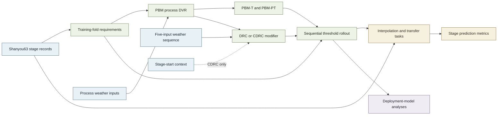
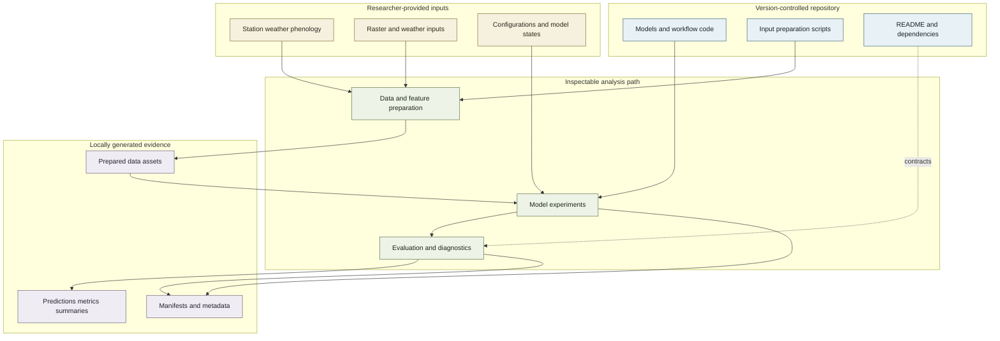

# Rice Phenology Hypernet

Supporting code for *Learning corrections to prescribed photothermal responses improve rice phenology prediction across environments*.

This repository provides the scientific models, shared rollout logic, evaluation utilities, regional-analysis modules, and input-preparation scripts that support the accompanying study. It is organized so that readers can trace how observations and environmental drivers enter the analysis, how each model changes daily phenological development, and where locally generated evidence is recorded.

## Overview

The study asks whether a learned modifier of process-derived daily DVR can improve phenological-stage prediction while retaining an explicit accumulated-development model. The modifier is strictly positive but can either decrease (`m < 1`) or increase (`m > 1`) the photothermal backbone DVR. All four study models use the same five ordered transitions - reviving-to-tillering, tillering-to-jointing, jointing-to-booting, booting-to-heading, and heading-to-maturity - and the same completion rule: accumulate daily progress for up to 120 days, select the first day that crosses the transition requirement, or otherwise use the final valid day, then start the next transition on the following day.

| At a glance | Repository scope |
| --- | --- |
| **Scientific question** | Can sequence learning correct daily process rates without replacing accumulated development, threshold crossing, or sequential rollout? |
| **Study system** | Shanyou63 rice; 328 site-year records from 46 southern China sites, 1984-2010 |
| **Maintained model set** | PBM-T, PBM-PT, DRC, and CDRC |
| **Evaluation layers** | Random site-year interpolation, unseen-site spatial transfer, later-year temporal transfer, and a bounded regional comparison |
| **Prediction targets** | Tillering, jointing, booting, heading, and maturity day of year |
| **Reader entry points** | Model definitions, experiment contracts, metrics, regional projection, and provenance utilities |

### Scientific framework



*The four-model comparison changes how daily DVR is formulated while preserving a common sequential threshold-crossing definition of transition completion.*

## Models and evaluation

### Model families and scientific roles

The manuscript defines the scientific names and roles in the four-model ladder; the current public registry, defined by `PAPER_MODEL_NAMES` in [`dvr_core.py`](src/rice_phenology_hypernet/experiments/dvr_core.py), supplies the corresponding implementation identifiers.

| Manuscript model | Repository ID | Scientific role and daily formulation | Constraint or correction | Prediction output |
| --- | --- | --- | --- | --- |
| PBM-T | `m0_t` | Thermal process baseline using mean temperature and a trapezoidal response | No photoperiod effect; training-fold median thermal requirements normalize daily development | First crossing DOY, or final valid DOY within the 120-day window |
| PBM-PT | `m0_dvr` | Photothermal process baseline using mean temperature and astronomical daylength | ORYZA2000 photoperiod suppression applies only to jointing-to-booting and booting-to-heading; requirements are estimated from training-fold photothermal accumulation | First crossing DOY, or final valid DOY within the 120-day window |
| DRC | `m1_v2_dvr` | One-layer GRU shared across transitions, with transition-specific heads, five daily weather inputs, and PBM-PT DVR | The network output is clipped to `[-2, 2]` and exponentiated, constraining the modifier to `[e^-2, e^2]`; values below or above 1 decrease or increase DVR | Corrected daily DVR, cumulative progress, smooth completion output, and rollout DOY |
| CDRC | `m1_dvr_con` | DRC plus transition identity, start DOY, and days since transplanting | A bounded state projection and transition-specific gate constrain stage-start context; prior and monotonic penalties encourage non-increasing context contribution | The DRC outputs plus learned context-gate values |

The study weather sequence is daily mean, minimum, and maximum air temperature, astronomical daylength, and precipitation, represented in code as `TemAver`, `TemMin`, `TemMax`, `daylength`, and `Precipitation`. Both learned models correct the PBM-PT backbone DVR. The implemented DRC objective follows the manuscript's four components: event timing, terminal progress, shrinkage toward an unchanged modifier, and temporal smoothness. CDRC adds gate-prior and gate-monotonicity penalties.

<details>
<summary>Model identifiers outside the current registry</summary>

The manuscript model ladder and tracked `main` registry correspond one-to-one as shown above. Neither source defines study models named `m1_dvr` or `m3_direct`, so those identifiers are not presented as paper terminology or current workflow options.

</details>

### Evaluation design

The experiment runner enforces the parts of the evaluation that must remain comparable across models:

1. Split records through the supplied backend.
2. Estimate model-specific requirements for all five transitions from each fold's training records only.
3. Fit a learned model when the selected model requires one.
4. Construct stage inputs, calculate base DVR, and obtain any learned modifier.
5. Correct and accumulate daily DVR, take the first unit-progress crossing, and advance sequentially.
6. Return predictions, scores, and an audit record containing task, model, seed, call order, and fold provenance.

The manuscript and repository task identifiers correspond as follows:

| Repository task | Manuscript task | Scientific purpose | Manuscript split design |
| --- | --- | --- | --- |
| `sample` | Random site-year | Interpolation | Five-fold random split of complete site-year records |
| `site` | Unseen-site | Spatial transfer | Five-fold site-grouped split; entire sites are held out, and test years must occur in the training fold |
| `year` | Later-year | Temporal transfer | Expanding-window rolling origin: 1984-1990 to 1991-1995, 1984-1995 to 1996-1998, and 1984-1998 to 1999-2010; test stations must occur in the corresponding training period |

All transitions from one site-year remain in the same partition. Within each outer fold, thermal requirements for PBM-T and photothermal requirements for PBM-PT, DRC, and CDRC are estimated only from training records. The manuscript further specifies internal validation for learned-model checkpoint selection, training sequences of up to 120 days, and a 120-day rollout search window, with the final valid day used when a transition does not cross its threshold. The public process models, tensor crossing helper, generic experiment runner, and regional projection path implement this same limit and fallback rule. The runner delegates split construction, sequence construction, fitting, internal validation, and scoring to `DvrWorkflowBackend`; a concrete study backend and experiment configuration are therefore required to instantiate the exact task splits and fitting protocols.

Metrics are MAE, RMSE, mean signed bias, and R-squared for tillering, jointing, booting, heading, and maturity, with an across-stage mean. The repository metric frame additionally carries sample count. Relative-change tables report DRC and CDRC against both `m0_t` (PBM-T) and `m0_dvr` (PBM-PT), matching the manuscript's baseline comparisons.

After outer-fold evaluation, the manuscript refits separate deployment models using all retained records. These fixed models support two downstream analyses: controlled perturbations of the CDRC response and a bounded regional comparison. The current public tree retains CDRC forward outputs needed to inspect corrected DVR, but it does not contain a dedicated perturbation-analysis workflow. The regional path is implemented: it applies all four deployment models over the 2003-2007 middle-rice grid, initializes reviving at five days after transplanting, averages annual predictions into a climatology, and compares heading and maturity DOY with ChinaRiceCalendar. This regional comparison assesses broad spatial transfer and does not establish reliable grid-cell prediction.

## Evidence map and data flow

### Scientific traceability

| Scientific role | Repository implementation | Main interface | Generated evidence |
| --- | --- | --- | --- |
| PBM-T and PBM-PT process backbones | [`models/physics.py`](src/rice_phenology_hypernet/models/physics.py), [`models/m0.py`](src/rice_phenology_hypernet/models/m0.py) | `M0TPhenologyModel` (`m0_t`), `M0PhenologyModel` (`m0_dvr`) | Inverted transition-requirement samples and process stage predictions |
| DRC and CDRC learned modifiers | [`models/m1_v2_dvr.py`](src/rice_phenology_hypernet/models/m1_v2_dvr.py), [`models/m1_dvr_con.py`](src/rice_phenology_hypernet/models/m1_dvr_con.py) | `M1V2DvrModel` (`m1_v2_dvr`), `M1ConDvrModel` (`m1_dvr_con`) | Modifier, corrected-DVR, cumulative-progress, and smooth-completion tensors |
| Fold-isolated experiment rollout | [`experiments/runner_dvr.py`](src/rice_phenology_hypernet/experiments/runner_dvr.py) | `run_dvr_experiment`, `DvrWorkflowBackend` | `DvrExperimentBundle` with predictions, metrics, and audit metadata |
| Stage evaluation and comparison | [`evaluation/metrics.py`](src/rice_phenology_hypernet/evaluation/metrics.py), [`experiments/dvr_summary.py`](src/rice_phenology_hypernet/experiments/dvr_summary.py) | `calculate_metrics_frame`, `build_dvr_relative_change_summary` | Per-stage metric frames and DVR relative-change CSV files |
| Controlled CDRC response inspection | [`models/m1_dvr_con.py`](src/rice_phenology_hypernet/models/m1_dvr_con.py) | `M1ConDvrModel.forward` | Daily modifier and corrected-DVR tensors; the manuscript's complete perturbation workflow is not tracked |
| Regional consistency analysis | [`regional_grid_projection.py`](src/rice_phenology_hypernet/experiments/regional_grid_projection.py), [`regional_grid_analysis.py`](src/rice_phenology_hypernet/experiments/regional_grid_analysis.py) | `prepare_regional_grid_inputs`, `run_regional_grid_projection`, `analyze_regional_grid_projection` | 2003-2007 point-year predictions, climatology tables, heading/maturity metrics, and JSON metadata |
| Run identity and provenance | [`runtime.py`](src/rice_phenology_hypernet/runtime.py) | `initialize_run`, `register_experiment`, `update_run_metadata` | Timestamped run directories, `latest.json`, config snapshots when available, and `run_manifest.json` |

### Repository evidence and provenance flow



*The analytical logic is version controlled; study inputs and run settings enter through explicit interfaces, and derived evidence remains linked to local run metadata.*

## Repository structure

Only paths tracked in Git are shown here. The committed `data/` and `artifacts/` trees contain directory placeholders rather than study records or completed runs.

```text
.
|-- README.md
|-- requirements.txt
|-- tests/                    # manuscript-alignment regression tests
|-- src/rice_phenology_hypernet/
|   |-- data/                 # station I/O and daylength
|   |-- models/               # process and learned DVR models
|   |-- experiments/          # rollout, summaries, and regional analysis
|   |-- evaluation/           # stage-level metrics
|   |-- runtime.py            # run ids, manifests, output discovery
|   |-- settings.py           # repository-relative path contract
|   `-- types.py              # input and result dataclasses
|-- scripts/
|   |-- china_rice_calendar/  # calendar download and raster preparation
|   `-- meteo_download/       # regional weather acquisition and QC
|-- data/                     # local input and prepared-data locations
`-- artifacts/                # local model, evaluation, figure, and table locations
```

The central ownership boundary is `DvrWorkflowBackend`: the repository runner owns scientific ordering and threshold rollout, while the backend supplies data splitting, feature construction, model fitting, prediction-record construction, and scoring. Regional deployment uses the analogous `RegionalModelProvider` contract so that model-state loading is explicit rather than coupled to one private storage layout.

## Getting started

The repository is a source tree rather than an installable Python package: no `pyproject.toml` or console entry point is tracked. Use `PYTHONPATH=src` when importing the package.

```bash
git clone https://github.com/SmartAG-NWAFU/rice_phenology_hypernet.git
cd rice_phenology_hypernet
python -m venv .venv
source .venv/bin/activate
python -m pip install --upgrade pip
python -m pip install -r requirements.txt
export PYTHONPATH=src
```

Inspect the maintained helper interfaces without supplying research data:

```bash
python scripts/china_rice_calendar/extract_middle_rice_pixels.py --help
python scripts/meteo_download/standardize_regional_grid_weather_gee.py --help
PYTHONPATH=src python -c "from rice_phenology_hypernet.experiments.runner_dvr import validate_recording_backend_contract; validate_recording_backend_contract(); print('workflow contract: ok')"
PYTHONPATH=src pytest -q tests/test_manuscript_alignment.py
```

### Input contracts

| Input | Minimum implemented contract | Typical local location | Ownership |
| --- | --- | --- | --- |
| Station weather | CSV with `SID`, parseable `Date`, and numeric `TemAver`; study features also use `TemMin`, `TemMax`, and `Precipitation`, with daylength calculated separately | `data/raw/` | Researcher provided |
| Station phenology | Excel table with `SID` (or `station ID`), `year`, `lat`, `lon`, `reviving date`, and chronologically ordered available stage dates | `data/raw/` | Researcher provided |
| Rice calendar | Period-specific transplanting, heading, and maturity GeoTIFFs | `data/external/china_rice_calendar/` | Downloaded or researcher provided |
| Regional weather | Point CSVs or standardized Parquet shards with point, date, temperature, precipitation, and location fields | `data/processed/` | Prepared locally |
| Experiment settings | Objects satisfying `DvrExperimentConfig`, including learned-model architecture and loss settings | Researcher selected | Study-specific |
| Trained deployment models | Four prepared models and per-stage requirements supplied by `RegionalModelProvider` | Commonly `artifacts/models/` | Study-specific |

Station-table preparation is exposed through `prepare_data_assets(RawDataPaths, PreparedDataPaths)` in [`data/io.py`](src/rice_phenology_hypernet/data/io.py). It standardizes and intersects station-year records, then writes cleaned weather and phenology Parquet files to caller-selected paths. The additional `modeling_dataset` and `threshold_samples` fields in `PreparedDataPaths` reserve explicit downstream destinations; this preparation function does not populate them.

The station loader also recognizes an optional `year` column; astronomical daylength is calculated separately from date and latitude.

## Running the workflow

### Main DVR experiment interface

`run_dvr_experiment` is the maintained orchestration interface. The following is an **expected invocation pattern**, not a self-contained paper run: `config` and `backend` must be supplied from the study data and evaluation design.

```python
from rice_phenology_hypernet.experiments.runner_dvr import (
    ExperimentSpec,
    run_dvr_experiment,
)

# Manuscript mapping: site = unseen-site task; m1_dvr_con = CDRC.
spec = ExperimentSpec(task="site", model_name="m1_dvr_con", seed=42)
bundle = run_dvr_experiment(spec=spec, config=config, backend=backend)

predictions = bundle.predictions
metrics = bundle.metrics
audit = bundle.audit
```

There is no tracked top-level command that constructs the paper's study-specific backend, hyperparameter objects, or trained states. Consequently, the public tree supports inspection and integration of the maintained method interfaces, while an end-to-end paper run additionally requires those external inputs.

### Regional input preparation

The calendar and weather scripts are independent CLI utilities. Their interfaces can be audited with `--help`; commands that contact the Harvard Dataverse or a local GEE service additionally require network/service access.

```bash
# Networked metadata check; prints the planned ChinaRiceCalendar downloads.
python scripts/china_rice_calendar/download_rice_calendar.py \
  --output-dir data/external/china_rice_calendar/dataverse_v8/rice_pixels \
  --dry-run

# Aggregate the source rasters to 0.05 degrees with at least 10 source pixels.
python scripts/china_rice_calendar/coarsen_middle_rice_rasters.py \
  --data-dir data/external/china_rice_calendar/dataverse_v8/rice_pixels \
  --output-dir data/artifacts/features/china_rice_calendar/middle_rice_0p05deg_median_min10_rasters/2003_2007 \
  --periods 2003_2007 \
  --block-size 5 \
  --min-support 10

# Extract the latitude-bounded table consumed by regional projection.
python scripts/china_rice_calendar/extract_middle_rice_pixels.py \
  --data-dir data/artifacts/features/china_rice_calendar/middle_rice_0p05deg_median_min10_rasters/2003_2007 \
  --output-dir data/artifacts/features/china_rice_calendar/2003_2007 \
  --periods 2003_2007 \
  --output-stem middle_rice_pixels_0p05deg_median_min10_lat16_35

# Local QC and standardization after regional point weather has been acquired.
python scripts/meteo_download/standardize_regional_grid_weather_gee.py \
  --input-dir data/processed/regional_grid_weather_gee_era5_2003_2007 \
  --output-dir data/processed/regional_grid_weather_gee_era5_2003_2007_clean
```

<details>
<summary>Regional projection programmatic interfaces</summary>

`prepare_regional_grid_inputs(...)` joins the supported `2003_2007` middle-rice calendar product to available point-year weather and records valid and excluded locations. Its default `reviving_offset_days=5` matches the manuscript's approximation from the observed median transplanting-to-reviving interval. `run_regional_grid_projection(...)` requires a `RegionalProjectionSpec` and `RegionalModelProvider`; it writes yearly predictions plus projection metadata. `analyze_regional_grid_projection(...)` converts those predictions into a five-year climatology and heading/maturity metrics.

The manuscript also reports a 2-15 day sensitivity analysis for the reviving offset. The public preparation interface accepts alternative offsets, but no dedicated sensitivity-analysis orchestrator is tracked. The current regional period registry contains `2003_2007`; other calendar periods handled by the preparation scripts are not automatically supported by the projection registry.

</details>

## Outputs, provenance, and repository scope

| Path or object | Content | Provenance behavior |
| --- | --- | --- |
| `DvrExperimentBundle` | In-memory prediction and metric frames plus audit metadata | Records task, model, seed, call order, fold id, and training-only requirement source |
| `artifacts/eval/<run_id>/run_manifest.json` | Run identity and registered experiment or regional metadata | Created and updated by `runtime.py`; paths inside the repository are stored relatively where possible |
| `artifacts/eval/latest.json` | Most recently initialized run id | Updated only when run initialization requests it |
| `artifacts/eval/<run_id>/config_snapshot/` | Copies of available `configs/*.yaml` at run initialization | Empty when no configuration files are supplied locally |
| `data/artifacts/features/` | Prepared regional point and point-year tables, exclusions, and input metadata | Built locally from calendar and weather inputs |
| `artifacts/eval/<run_id>/regional_grid_projection/` | Yearly predictions, climatology, heading/maturity metrics, and JSON metadata | Produced by regional projection and analysis interfaces |
| `artifacts/models/`, `artifacts/figures/`, `artifacts/tables/` | Reserved locations for caller-managed model states and derived presentation outputs | Directory conventions are tracked; generated contents are ignored by Git |

The repository separates version-controlled analytical implementations from study-specific inputs and locally generated run artifacts. Git currently tracks the Python source, preparation scripts, focused regression tests, version-pinned requirements list, README, and empty data/artifact directory markers. Station records, prepared tables, experiment configuration values, trained weights, and completed result files are supplied or created locally. This keeps the model and evaluation logic inspectable while making the additional material required for a particular run explicit.

The focused test module [`tests/test_manuscript_alignment.py`](tests/test_manuscript_alignment.py) checks the four-term DRC objective, fixed modifier bound, model-specific requirement contract, transition construction, 120-day fallback, and two-baseline summaries without research data. A dependency-light synthetic check, `validate_recording_backend_contract()`, separately verifies experiment call order, reuse of training-derived stage requirements, and sequential rollout trace. Data-dependent training, regional projection, and paper-result regeneration require the corresponding external inputs and model provider.

### Verification status for this revision

| Verification level | Checked material |
| --- | --- |
| Executed without study data | Package import; 20 manuscript-alignment regression tests; synthetic workflow contract; `--help` for calendar extraction, raster coarsening, calendar download, regional weather download, and weather standardization; Dataverse `--dry-run` metadata retrieval |
| Statically checked against source | Manuscript title, study population, model terminology, transition definitions, evaluation splits, metrics, deployment analyses, and scope; repository model registry and forward paths; data schemas; programmatic interfaces; output filenames; internal Markdown links; Mermaid structure and accessibility directives |
| Not executed in this repository snapshot | Raster extraction, weather standardization, model fitting, station evaluation, and regional projection, because their research inputs, experiment objects, or trained model provider are not tracked |

No local Mermaid renderer was available during this documentation revision; both diagrams use GitHub-supported `flowchart` syntax and were checked statically rather than rendered locally.

## Citation and contact

Please cite the accompanying manuscript:

> Chen, B., Tan, J., Yao, L., Benaly, M. A., Wu, G., Wu, D., Yu, Q., Mamassi, A., and Zhao, G. *Learning corrections to prescribed photothermal responses improve rice phenology prediction across environments*.

Publication venue, year, volume, pages, and DOI are not specified in the manuscript file reviewed for this revision, so no provisional bibliographic values are asserted here. When reporting analyses from this repository, also identify the repository URL and commit used.

For scientific correspondence, contact Gang Zhao at `gang.zhao@nwafu.edu.cn`, as listed in the manuscript. Implementation and reproducibility questions may also be submitted through the repository's [GitHub issue tracker](https://github.com/SmartAG-NWAFU/rice_phenology_hypernet/issues).
